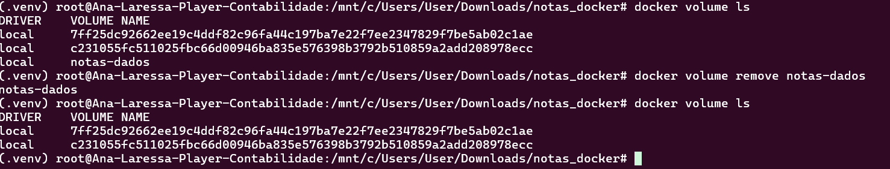

# Relatório — Implementação de Serviços com Docker

## Objetivo

Foi desenvolvido um serviço de anotações em Python usando FastAPI e SQLite. A aplicação foi empacotada em uma imagem própria do Docker e os dados foram persistidos usando o volume nomeado `notas-dados`.

## Aplicação e teste local

As rotas implementadas foram `GET /health`, `POST /notas` e `GET /notas`. O banco SQLite é criado em `DATA_DIR/notas.db`, usando `/app/data` como diretório padrão. A documentação foi acessada em `http://localhost:8000/docs`.

Evidências:\n\n\n\n

## Dockerfile

- `FROM python:3.12-slim`: imagem oficial enxuta do Python.
- `WORKDIR /app`: define o diretório de trabalho.
- `COPY requirements.txt .`: copia primeiro as dependências para aproveitar o cache.
- `RUN pip install`: instala as dependências.
- `COPY app.py .`: copia o código.
- `ENV DATA_DIR=/app/data`: define o diretório de dados.
- `EXPOSE 8000`: documenta a porta da API.
- `VOLUME ["/app/data"]`: declara o diretório persistente.
- `CMD`: inicia o Uvicorn.

## Etapa 3 — Build

Foi executado `docker build -t notas-api:1.0 .`, concluído com sucesso e com a imagem marcada como `notas-api:1.0`.

Evidências: `evidencias/Captura de tela 2026-09-18 212837.png` e `evidencias/Captura de tela 2026-09-18 212842.png`.

O comando `docker image ls notas-api` mostrou aproximadamente `255 MB` de uso em disco e `61.5 MB` de conteúdo. O comando `docker history notas-api:1.0` exibiu as camadas da imagem: base Python, diretório de trabalho, dependências, código, variável de ambiente, porta, volume e comando de inicialização.

Evidência:\n\n

## Etapa 4 — Execução com volume

Foi criado o volume `notas-dados` e o contêiner foi executado com `-v notas-dados:/app/data`. O contêiner ficou ativo e os logs confirmaram o início do Uvicorn na porta 8000.

Evidência:\n\n

Foram criadas três anotações. A rota `GET /notas` retornou os três registros com identificadores, textos e datas.

Evidência:\n\n

## Etapa 5 — Persistência

O contêiner original foi parado e removido com `docker stop notas` e `docker rm notas`. O volume continuou existindo, conforme `docker volume ls`.

Evidências:\n\n\n\n

Foi criado o contêiner `notas2` usando novamente o mesmo volume. A consulta `GET /notas` retornou as três anotações anteriores e `docker exec notas2 ls -la /app/data` mostrou o arquivo `notas.db`.

Evidência:\n\n

Isso comprova que o volume preserva os dados mesmo após a remoção do contêiner.

## Etapa 6 — Contraexemplo sem volume

Foi executado um contêiner sem `-v`. Uma nota temporária foi criada e apareceu na listagem, conforme o print abaixo.\n\n

Depois o contêiner foi removido e outro foi criado também sem volume. A consulta seguinte retornou `[]`, conforme o print abaixo.\n\n

Sem volume, o banco fica no sistema de arquivos temporário do contêiner e é destruído junto com ele.

## Etapa 7 — Inspeção

`docker volume inspect notas-dados` informou o ponto de montagem `/var/lib/docker/volumes/notas-dados/_data`.

Evidência:\n\n

O arquivo `notas.db` foi encontrado em `/app/data`. Se for executado `docker volume rm notas-dados` com os contêineres removidos, o volume e o banco SQLite serão apagados definitivamente.

## Dificuldades e aprendizados

Foi necessário utilizar um ambiente virtual Python porque o Ubuntu bloqueia a instalação global de pacotes com `pip`. O principal aprendizado foi entender que a imagem contém o código e as dependências, enquanto o volume mantém os dados fora do ciclo de vida do contêiner. O teste sem `-v` confirmou que o sistema de arquivos do contêiner é efêmero, pois a anotação desapareceu após a remoção e recriação do contêiner.

## Referências

- https://docs.docker.com/get-started/
- https://docs.docker.com/reference/dockerfile/
- https://docs.docker.com/engine/storage/volumes/
- https://docs.docker.com/build/building/best-practices/
- https://hub.docker.com/_/python

## 12. Evidências visuais

### Teste da API local

### Construção da imagem Docker

### Execução e persistência com volume

### Contraexemplo sem volume

### Inspeção do volume

### Remoção definitiva do volume

Com os contêineres parados e removidos, foi executado `docker volume rm notas-dados`. O comando confirmou a remoção do volume e, consequentemente, a exclusão definitiva do banco e das anotações armazenadas nele.

`n

